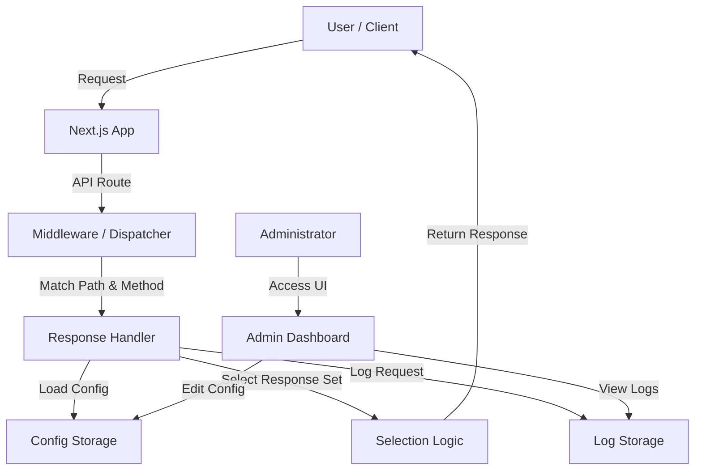

# 作成方針

## 1. 技術スタック選定
- **フレームワーク**: Next.js (App Router)
    - 理由: APIルートによるバックエンド処理と、Reactによるリッチな管理画面UIを単一のプロジェクトで完結できるため。また、VercelやAWS(コンテナ)へのデプロイも容易。
- **言語**: TypeScript
    - 理由: 型安全性による保守性の向上（プロジェクト共通ルール）。
- **スタイリング**: Tailwind CSS
    - 理由: 迅速なUI構築とカスタマイズ性（プロジェクト共通ルール）。
- **データ永続化**:
    - **抽象化レイヤー (Repository Pattern)** を採用し、環境（ローカル/AWS）に応じて保存先を切り替え可能にする。
    - **Local**: ローカルファイルシステム (JSONファイル等) または SQLite。
    - **AWS**: S3 (JSON保存) または DynamoDB。
    - 当初はローカル開発を優先し、`lowdb` や単純なファイル操作で実装を進める。

## 2. アーキテクチャ概要

## 3. 開発ステップ

### Step 1: プロジェクト初期化と基盤構築
1.  Next.js プロジェクトのセットアップ (TypeScript, Tailwind CSS)。
2.  共通レイアウト作成（Header, Sidebar等）。
3.  データ型定義 (TypeScript Interface/Type)。
    - `EndpointConfig`
    - `ResponseSet`
    - `RequestLog`
    - `GlobalConfig`

### Step 2: データアクセス層の実装
1.  Repository インターフェースの定義。
2.  ローカルファイルベースの実装 (開発用)。
    - 設定データのSave/Load。
    - ログデータのAdd/List/Filter/Delete。

### Step 3: ダミーサーバー コア機能実装
1.  動的ルーティング (`[[...slug]]`) の作成。
2.  リクエストハンドリングロジックの実装。
    - パス・メソッドの一致判定。
    - レスポンスセット選択ロジック (Default, Random, matcher)。
    - リクエストの記録 (Logging)。

### Step 4: 管理画面 (設定機能) 実装
1.  エンドポイント一覧・作成画面。
2.  エンドポイント詳細設定画面。
    - メソッド有効化スイッチ。
    - レスポンスセット編集 (Status, Body, Headers)。
    - 切替ロジック設定。
3.  設定のインポート・エクスポート機能。

### Step 5: 管理画面 (ログ機能) 実装
1.  ログ一覧表示画面 (Table UI)。
2.  フィルタリング・検索・ソート機能 UI。
3.  ログ削除機能。
4.  ログエクスポート機能 (CSV, JSON, Excel)。

### Step 6: AWS対応・検証
1.  AWS用ストレージアダプタの実装 (S3 or DynamoDB)。
2.  Dockerコンテナ化 (Dockerfile作成)。
3.  デプロイ手順の整備。
